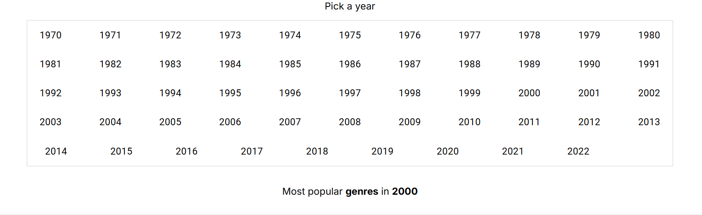
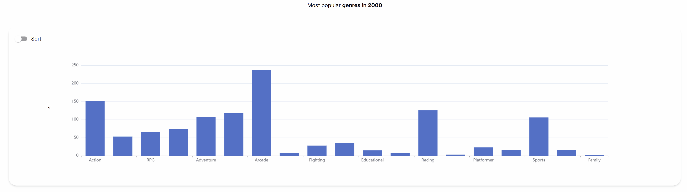
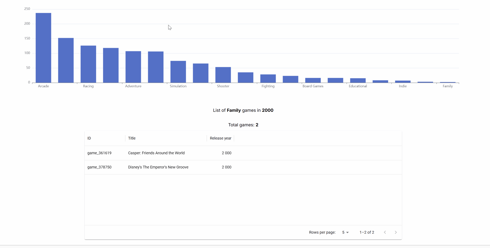
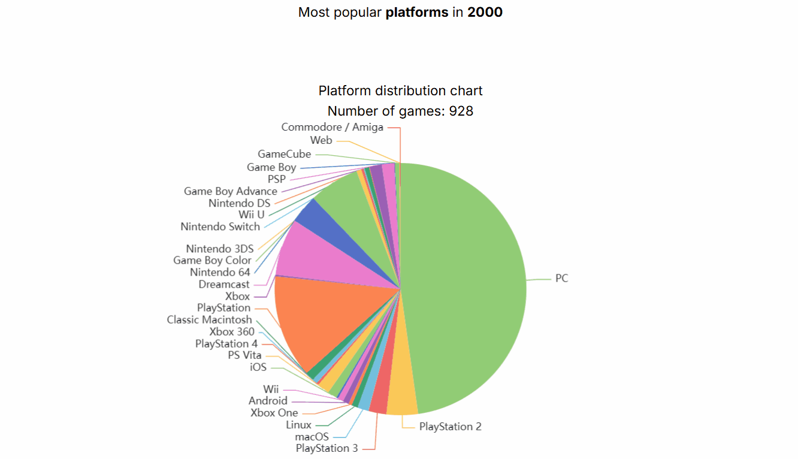
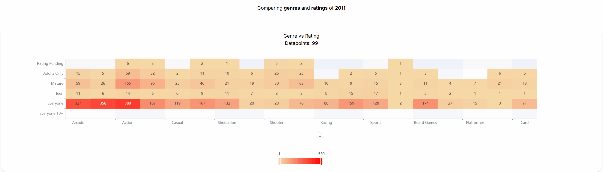

# Game Analyzer

## Project Description

Write a brief description of your application here. The description should provide an overview of the application features, its purpose, and how it achieves the objective of the assignment. Discuss the dataset used and why it was chosen.

Describe the insights you are providing through your interactive visualization. Highlight the questions this project is intended to answer or the insights you aim to provide.

This project aims to give an overview of popular genres and platforms for video games between 1970 - 2022.

The dataset was chosen because it stores over 400,000 games with the following data:
- Title 
- Release year 
- Developers 
- Genres 
- Platforms
- Rating

With the dataset I can visualize how each year has impacted the types of games on the market. 
- Which **genres** were _popular_? 
- Which **platforms** has _dominated_? 
- How does **genres** and **esrb-ratings** _correlate_?

The webapplication visualizes this information with:
- **Bar graph** - Popular genres
- **Pie chart** - Dominant platforms
- **Heatmap** - Frequency of genres and ratings

## Core Technologies

Include a list of the main technologies used in your project. Explain why you decided to use these technologies and what benefits they have provided in accomplishing your goals. This can include the backend framework, data analysis and processing tools, data visualization library, frontend technology, and deployment platform.

**Tech stack:** 
- React - _Frontend_
- Fastify - _Backend_
- MongoDB - _Database_
- Vercel - _Production Environment_

**React** was used to quicky make visual components to visualize the data. Tailwind was used to quicky style the components. A FetchService was created with graphql-request to communicate with the backend. To visualize the data Echarts was used for the graphs and Material UI for a table and components to select year and sort data where applicable. Echarts handles large amount of data well, is well documented and provided many example graphs with code.

**Fastify** was used on the backend with Mercurius for GraphQL functionality. It's from the previous API assignment but I've expanded some functionality. GraphQL was used to specify what type of data I need for a specific visualization. Expanded functionality was pagination and filtration based on genres and total count of game documents from the database. Often used fields in queries has been indexed in the database to find them faster. Mercurius also uses caching for queries.

**Vercel** was used to deply the applocation. Game API from the previous API assignment was deployed in a similar fashion because of how it connects well with the Github repositostory. It is also compatible with many frameworks and is easy to push to deployment with CI/CD pieplines. 

## How to Use
Navigate to a graph. Each graph needs a year to start visualizing data. The default year is 2000. By selecting a year each graph will update.

**Select a year**

**Popular Genres**
The popular game genres graph can be sorted with the sorting switch and by hovering over each bar you can see information about amount of games and genre.

By clicking on a bar you can get more insight into the type of games in that genre. 

**Popular Platforms**
The popular platforms pie chart gives insight on which platforms has been popular for each year.

**Genre vs Ratings**
This heatmap shows the frequency of game genres with each ESRB rating. By changing the year you can see how different years have differnt distrubution and frequencies of certain ratings and genres. 

The slider of the heatmap allows you to filter between the more or less frequent datapoints.

## Link to the Deployed Application

- [Backend](https://api-design-theta.vercel.app)
- [Client](https://game-analyzer-nine.vercel.app)
- [Github Backend](https://github.com/RobinPett/API-Design)
- [Github Client](https://github.com/RobinPett/wt2)

## Acknowledgements

Resources I've used:
- [Echarts](https://echarts.apache.org/examples)
- [Material UI](https://mui.com/material-ui)